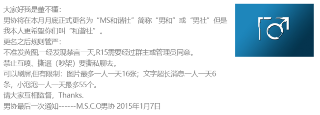
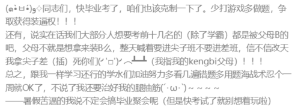
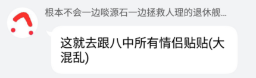

# **历史**

## **起源**

2012年11月14日，小学四年级上学期。dbd发现自己的qq账号原来不用等到"一个太阳"的等级就可以创建群聊，便创了名为"董事会"的qq群，邀请了一些认识的同学。2013年5月9日，dbd因无法忍受班干（班内戴二、三道杠的，除班长外都是女生）对班群管理权限的滥用以及对同学的辱骂，创建了"四（1）班男同学协会"群，班内关系较好的男生被邀请入群。
>**需要注意的是，取"男协"名称仅因为其声明直接反对来自女班委圈子的霸凌且当时确认的被霸凌者只有男生，无性别偏见，也有与此事无关的女生加入了男协群正常聊天。2021年的logo更改也是为了避免产生争议。**
>根据元老成员ll的回忆，当时带动暴政的两大巨头是hy、wxy，暴政包括但不限于：眼保健操揪头发、打小报告。

dbd作为"协会会长"，宣布以推翻女班委暴政为宗旨的"男协"的成立，一个正常的班内聊天群自此开始活跃。

男协成立不久，自称不需要女同学协会的女班委成立了女同学协会。与当时严肃的男协不同，女协成立之初便要求成员其加入，并给予较高职权。作为交换，她们允许会长加入女同学协会。这种随意的请求被男协当场拒绝。

男协成立后在反霸凌方面做出了许多贡献，在数次重要斗争中，成功击退霸凌对象。虽然经常遭到反击，但成功团结了班内的男同学，形成了有效的保护。在班上挥舞着男协logo的成员正是男同学站起来了的象征。

五年级下学期时，因为群活跃情况的性质发生变化，与女班委的斗争性减弱，群名被改为M.S.C.O.(Male Student Conservancy Orgnaization)。
2015年1月7日，考虑到小学毕业后的情况，dbd发布更名公告，同月月底群名改为"MS和谐社"。

---

## **发展**

### **小学阶段（2013.5-2015.6）**
#### 群成员情况：
该阶段群人数约15左右，该阶段入群的群成员为元老成员。男协主要面对暴政女班委、du娘两大敌人。群更名为MS和谐社后，性质从中二组织正式变为聊天群。
受早期互联网御宅文化的影响，语言内容二次元浓度较高。

#### 活动：
该阶段承办的最大线下活动包括张尧演唱会、dbd生日会等；最大线上活动有新年大搞笑、"男协吐槽大会（每周举办，共举办了5周）"等。

#### 制作：
**插画：** dbd的两位OC——洛莹和提娜诞生。

### **初中阶段（2015.9-2018.6）**
#### 群成员情况：
去除小号外，该阶段群人数约30左右。MS和谐社在该阶段进行了一次活跃成员过渡，大量来自dbd和咸鱼所在班级、信息学奥赛培训认识的同学加入该群，其中，活跃至今的群友大多为OIer。
因小学时斗争彻底结束，群主邀请了部分小学同学回群。
dbd在18年2月底与乱画练手Proj现群主壹陆等人建立联系、MS部分擅长绘画的群员加入了乱画练手Proj；为便于联系，同时避免圈子合并导致的活跃成员过渡，dbd仅邀请壹陆加入了MS主群。
早期互联网影响减弱，语言内容二次元浓度减弱。

#### 分群结构情况：
"董事会"群移除部分群员后更名为"大 草 原"，用以分流MS主群敏感内容；"MS跑团社"分群成立，用来分流跑团信息。

#### 活动：
该阶段举办的线下活动包括假期的例行聚会，线上活动包括MC联机、打求等。

#### 制作：
**游戏：** 咸鱼制作了游戏《凯撒传说》；dbd制作了游戏《穿越空间站》、临摹了游戏《Old TV》；ice制作了游戏《OIer's Life》；蓝猫临摹了游戏《2048》。

**插画：** dbd投稿了赛博朋克插图《rest》；讲述洛莹和提娜故事的插画系列《辉光》开始构思。

**鬼畜：** BJ察觉了念呆的舞蹈天赋，给予dbd重要启发，与dbd联合制作了《念式鬼步》。

<video width="320" height="240" controls="controls" preload="auto">
    <source src="../_media/intro/history/%E5%BF%B5%E5%BC%8F%E9%AC%BC%E6%AD%A5.mp4" type="video/mp4">
</video>

### **高中阶段（2018.9-2021.6）**
#### 群成员情况：
去除小号外，该阶段群人数约40左右。由于群员升入不同的学校，成员结构被主要分为三中、八中两个部分。同样，该阶段也有活跃成员过渡，大部分初中入群的非OIer群友不再活跃。
该阶段加群的群员来源比较复杂，几名三中、八中分部群友邀请认识的同学加入该群；咸鱼邀请了来自浙江的小米等人加入该群，将小米等人的圈子与MS进行了合并。
为保持当前氛围，避免新群员挤掉现有活跃成员，2020年底开始，MS不再接受新群员的加入。
受互联网文化影响，语言内容开始抽象，众多、八中分部内部梗形成。

#### 分群结构情况：
"大 草 原"群更名为"MS男科医院"，"MS旅行社"分群成立，用来分流旅游时的群成员信息。
MS男科医院在经过讨论后，限制了除成人内容外的所有敏感信息，作为纯色图群分流。

#### 活动：
该阶段举办的线下活动包括假期的例行聚会、参观CJ2019，线上活动包括MC联机、Apex、打求等。

#### 制作：
**游戏：** 咸鱼制作了游戏《AI竞技场》、制定了《饼干护送队》的建筑生成标准；dbd和hgf制作了AVG框架Demo《幻想乡IDE计划》；念呆制作了2D平台动作游戏练习工程《玫兰莎的冒险》、完善了《饼干护送队》的故事背景；金外、三中分部的群友分别用MC还原了各自的学校。

**插画：** dbd的《辉光》、《有备无患》系列开始试更新。

### **大学阶段（2021.9-）**
#### 群成员情况：
去除小号外，该阶段群人数约40左右。成员活跃情况不变。大部分群员在学期内分散至全国各地。
受互联网抽象文化影响，语言内容进一步抽象。

#### 分群结构情况：
"大 草 原"群更名为"MS男科医院"，"MS旅行社"分群成立，用来分流旅游时的群成员信息。
MS男科医院在经过讨论后，限制了除成人内容外的所有敏感信息，作为纯色图群分流。

#### 活动：
该阶段举办的线下活动包括假期的例行聚会、千岛湖-杭州游、参观广州CPSP，线上活动包括MC联机、Apex、打求等。

#### 制作：
**游戏：** 咸鱼与dbd合作了2D多人射击游戏《CER-65-RUS》、咸鱼制作了sasaki shader、++用MC还原了《流浪地球2》的太空电梯和《铃芽之旅》的场景。

**插画：** dbd投稿了《K-ON》同人系列插画《K-ON! Summer Special》。