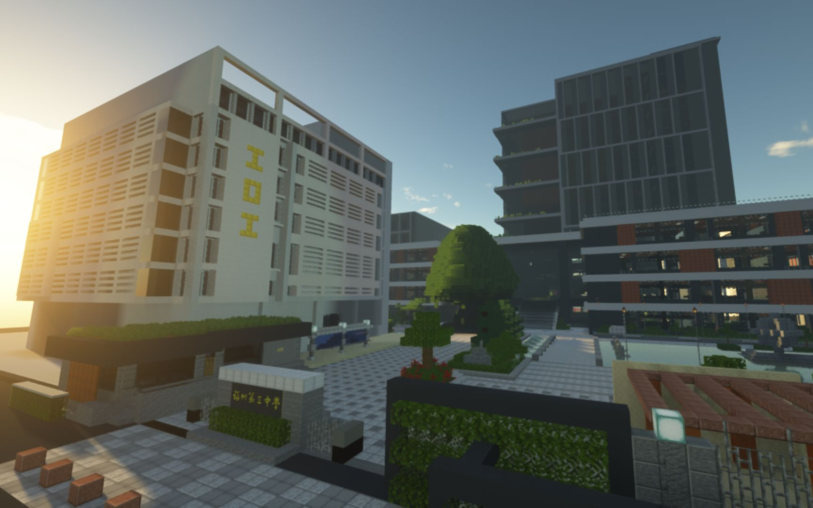
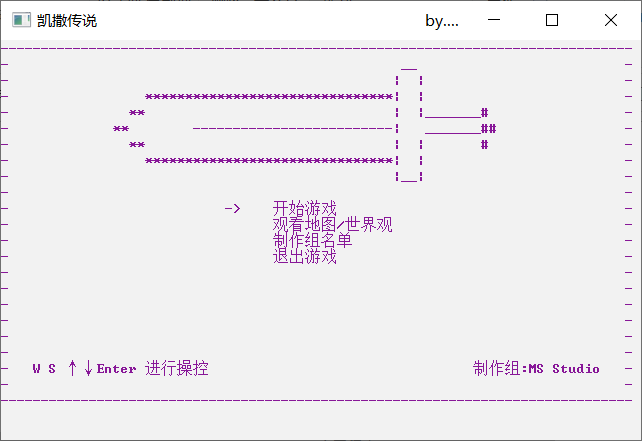
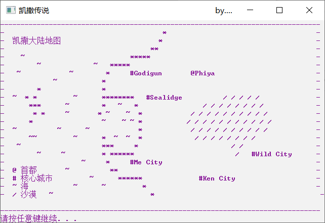
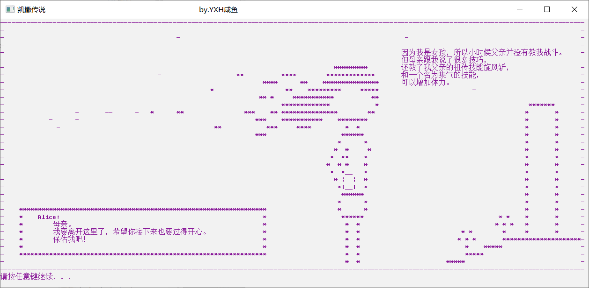
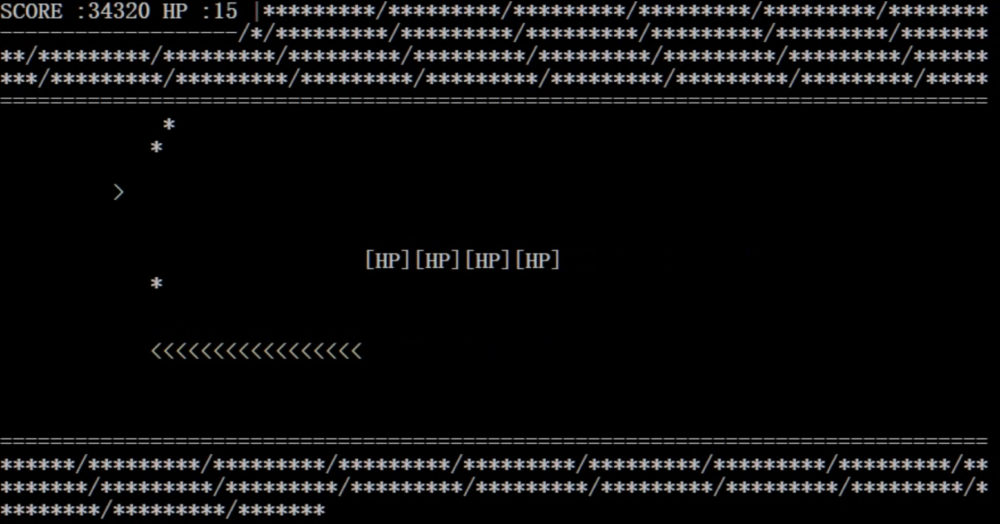
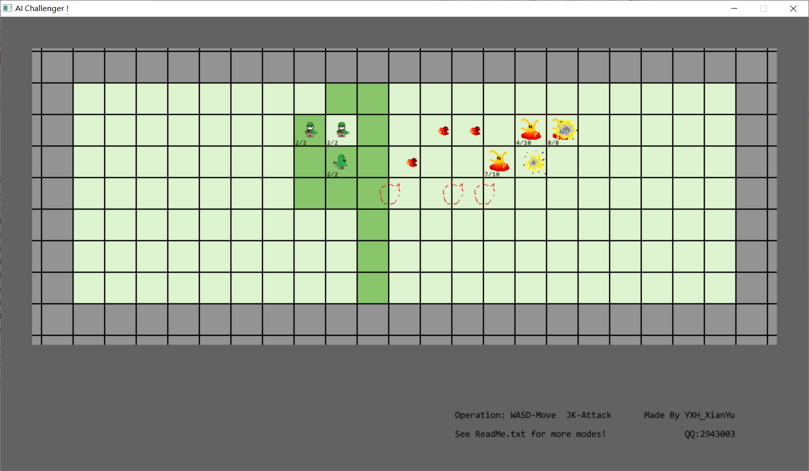
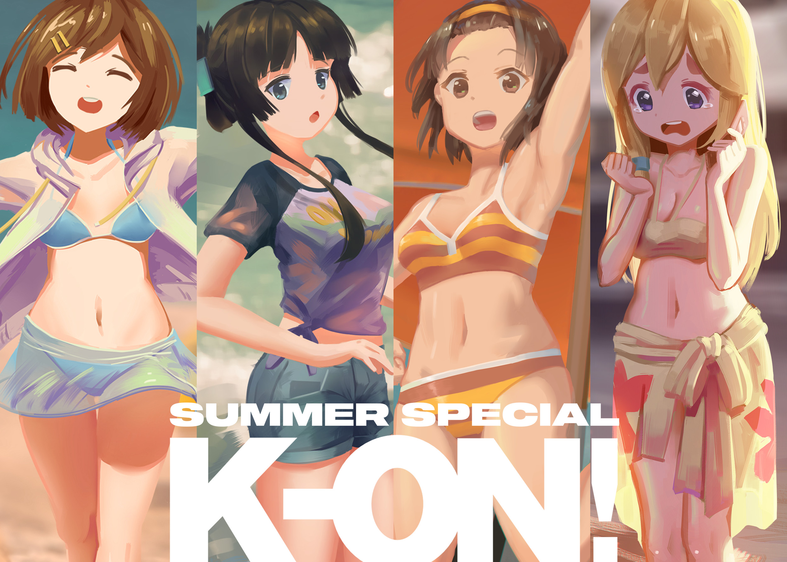
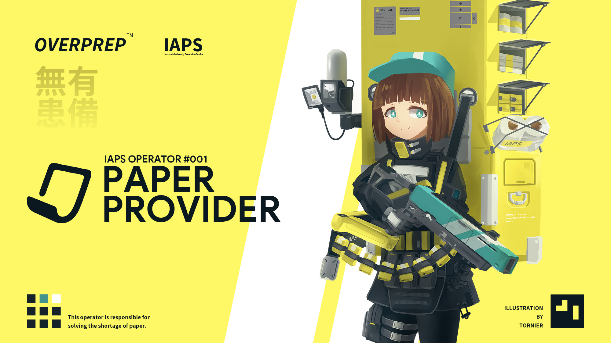

# 作品

## 福州三中MC复原

* [如果在MC中还原了你的学校【光线追踪/60fps】](https://www.bilibili.com/video/av244055657)

* 制作于 2020.4-2020.7

* 

***

## 凯撒传说

* 一个以字符画为特色的短篇JPRG，讲述了一位少女勇者不断成长，最终解开父亲死亡的谜团，拯救世界的故事。

* 制作于2017年8月初的那次夏令营。

* 游戏时长约半小时（待续）。

* 游戏菜单

  ​	

  * 游戏地图

    ​	

  * 游戏画面

    ​	

***
## 穿越空间站
> dbd制作于2017年8月初夏令营的一个横版弹幕射击游戏

***
## 人工智能：挑战者

> 咸鱼鱼在高二的课余时间搓的小游戏/软件

* 一个关于 动作+编程+多人 的小游戏

* 详细简介&Github：[AIChallenger](https://github.com/YXHXianYu/AIChallenger)

* 

***

## CE R65-RUS
> 咸鱼鱼的课程作业

基于《饼干护送队》世界观的2D射击小游戏（虽然关系不大就是了），支持双人联机。

***
## Sasaki Shader
>咸鱼鱼制作的MC光影Shader

***
## K-ON! Summer Special 同人系列插画
> dbd的夏日主题K-ON同人，参考番剧内出现的泳装进行绘制

[CIRCLE AROUND - 平泽唯](https://www.pixiv.net/artworks/91112651)

[EMERLAD WAVES - 秋山澪](https://www.pixiv.net/artworks/92331591)

[PLAY FIRST - 田井中律](https://www.pixiv.net/artworks/99986866)

[DIDN'T NEED - 琴吹紬](https://www.pixiv.net/artworks/100750905)

***

## ***OVERPREP™️*** **（有备无患）** 原创设定集
>dbd(Tornier)以生活中常见的问题为灵感，设定了一系列能在特定情况下雪中送炭的干员装备。

内容基本为架空机构IAPS(Identify. Act. Prevent. Inessential Adversity Prevention Service，非重要惨剧回避服务)内各干员的设定。
感谢
[壹陆](https://twitter.com/Bz16_)
提供的架空机构名称。

[#001 PAPER PROVIDER](https://www.pixiv.net/artworks/79205511)

[#002 NEPTUNE](https://www.pixiv.net/artworks/90768143)

[#003 ANTENNA](https://www.pixiv.net/artworks/95773020)

